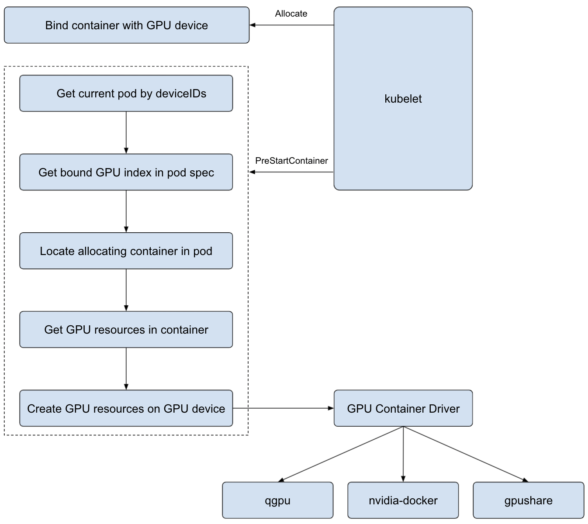

# Nano GPU Agent
## About this Project
*Nano GPU Agent* is a Kubernetes device plugin implement for gpu allocation and use in container. It runs as a Daemonset in Kubernetes node. It works as follows:
- Register gpu core and memory resources on node
- Allocate and share gpu resources for containers
- Support gpu resources qos and isolation with specific gpu driver(e.g. nano gpu)

For the complete solution and further details, please refer to Nano GPU Scheduler.

## Architecture

